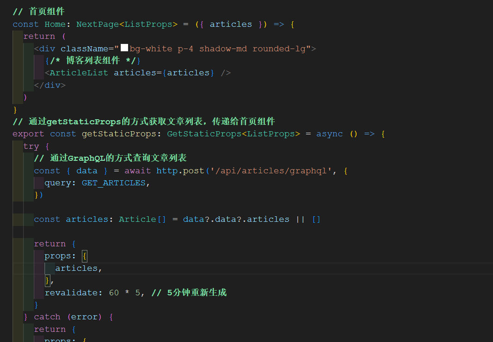
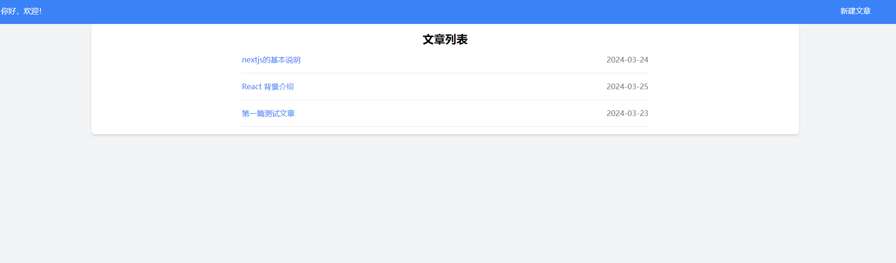
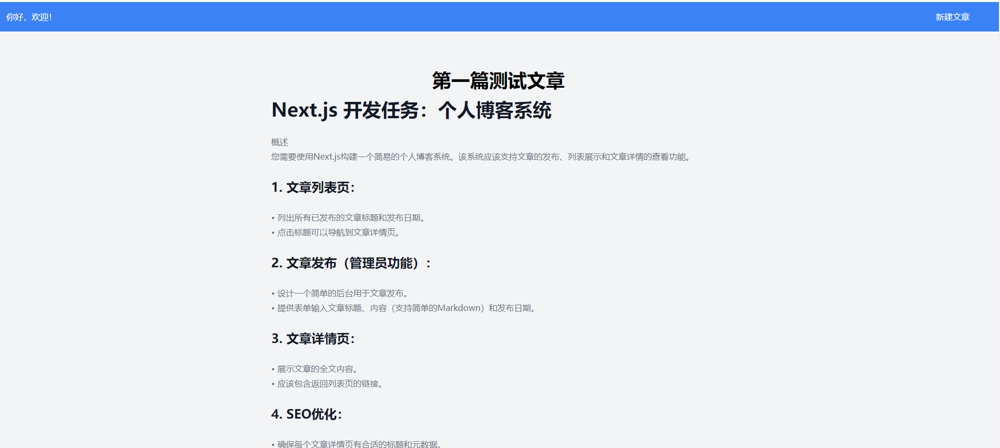
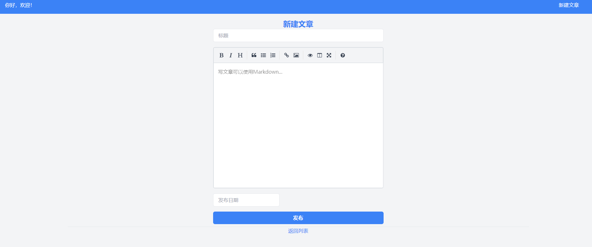

This is a [Next.js](https://nextjs.org/) project bootstrapped with [`create-next-app`](https://github.com/vercel/next.js/tree/canary/packages/create-next-app).

# Next.js ：个人博客系统

## 功能概述

- 文章的发布
- 列表展示
- 文章详情的查看功能。

## 技术栈

- nextjs - 是一个 React 框架，它支持服务器端渲染、静态站点生成和无缝客户端导航
- react-datepicker - 日期控件
- react-simplemde-editor - 富文本编辑器（支持 markdown）
- react-markdown - markdown 文本解析器
- react-toastify - 通知组件
- apollo-server-micro - 一个用于构建 GraphQL 服务器的微服务库
- axios - 一个基于 Promise 的 HTTP 客户端
- graphql - 是一种由 Facebook 开发的用于 API 查询语言和运行时的服务端运行环境
- moment -是一个 JavaScript 日期处理库，用于解析、验证、操作和格式化日期和时间
- mysql- 关系数据库
- dotenv - 是一个 Node.js 应用程序的环境变量加载库
- tailwindcss - 一个高度可定制的 CSS 框架

## 数据库创建命令

```shell
CREATE DATABASE blog DEFAULT CHARACTER SET utf8mb4 ;

USE `blog`;

/*Table structure for table `articles` */

DROP TABLE IF EXISTS `articles`;

CREATE TABLE `articles` (
  `id` int(11) NOT NULL AUTO_INCREMENT,
  `title` varchar(50) COLLATE utf8mb4_bin NOT NULL COMMENT '博客标题',
  `content` text COLLATE utf8mb4_bin COMMENT '博客内容',
  `published_date` varchar(10) COLLATE utf8mb4_bin NOT NULL COMMENT '写入博客时间',
  `updated_date` varchar(10) COLLATE utf8mb4_bin NOT NULL COMMENT '更新博客时间',
  PRIMARY KEY (`id`)
) ENGINE=InnoDB AUTO_INCREMENT=48 DEFAULT CHARSET=utf8mb4 COLLATE=utf8mb4_bin;
```

## 文件结构

```shell
BLOG
├── components
│       ├── types
│       │     └── types            #类型定义接口
│       ├── ArticleDetail.tsx      #文章详细组件
│       ├── ArticleForm.tsx        #新建文章表单组件
│       ├── ArticleList.tsx        #文章列表组件
│       ├── Footer.jsx             #页脚组件
│       ├── Header.tsx             #页头组件
│       ├── Layout.tsx             #布局组件
├── lib
│     ├── db.js                    #MYSQL数据查询封装组件
│     ├── http.js                  #axios请求封装组件
│     ├── resolvers.js             #graphql查询构造器组件
│     ├── schema.js                #数据结构构造
├── node_modules                   #模块 （npm install可以安装）
├── pages
│       ├── admin
│       │     └── new-article.tsx  #新建文章
│       ├── api
│       │     └── articles
│       │             ├── [id].js    #文章查询
│       │             ├── allIds.js  #所有文章ID查询，用于构造getStaticPaths
│       │             ├── graphql.js #实例化ApolloServer，并发送文章列表请求查询
│       │             ├── index.js   #已废弃，也是用于文章列表查询。
│       │             ├── new.js     #新建文章
│       ├── article
│       │     └── [id].tsx          #文章详情组件（getStaticProps和getStaticPaths）
│       ├── _app.tsx                #构建布局组件
│       ├── _document.tsx
│       ├── index.tsx               #首页
├── public
│   └── favicon.ico
├── styles
│   └── globals.css
├── .env                           #环境配置
├── .env.local
├── blog.sql                       # 数据库备份
```

## 运行

```shell
npm install
npm run dev
```

然后打开[http://127.0.0.1:3000](http://127.0.01:3000)就可以访问了。

**注意**

```shell
node 版本18.19以上，该代码的node版本是 18.19.1，可用nvm控制版本。
```

## SEO 优化

- 列表页和详细页（SSG），使用动态生成静态页面的方法。目前设定每隔 5 分钟重新生成。
- 添加标题（Title）。
- 添加元描述（Meta Description）
- 添加结构化数据（Structured Data

```shell
  <>
  <script type="application/ld+json">
    {`
      {
        "@context": "https://schema.org",
        "@type": "BlogPosting",
        "headline": "${article.title}",
        "description": "${article.excerpt}",
        "datePublished": "${article.publishedDate}",
        "author": {
          "@type": "Person",
          "name": "${article.author}"
        }
      }
    `}
  </script>
```

- 添加 Canonical 链接
- 添加 keywords

## 样式

- TailwindCSS

## 数据查询说明

- 首页（列表页）采用 GraphQL 查询，使用 Apollo Server 作为 GraphQL 服务端运行环境。
  
- 查询文章列表，使用 getStaticPaths 方法，通过 getStaticPaths 方法，

## 部署

因为不是纯静态的网站，需要新增文章，并且使用了 mysql 数据库，
所以就没有用 Vercel 部署，而是使用了自己服务器部署的。
访问地址：[blog.xujianlei.work](http://blog.xujianlei.work)

## 文章列表



## 文章详情



## 新增文章



## 请知晓

- 由于是用的动态生成静态页面的方式，时间设置的是 5 分钟重新生成静态页面，所以新增文章，列表页不会立即更新。
- 由于有缓存的原因，可能返回状态是 304，新增文章过了 5 分钟，也不会立即有效果，
  可以按 F5 强制更新缓存，或换一个浏览器，再查看新增效果。
- 本地运行 npm run dev 没有以上两种问题。
- github 上有类似需求的博客系统：[地址]（https://github.com/SunsetFrost/blog），
  不过，我还是按照需求自己写了代码，并和 mysql 进行了交互。
